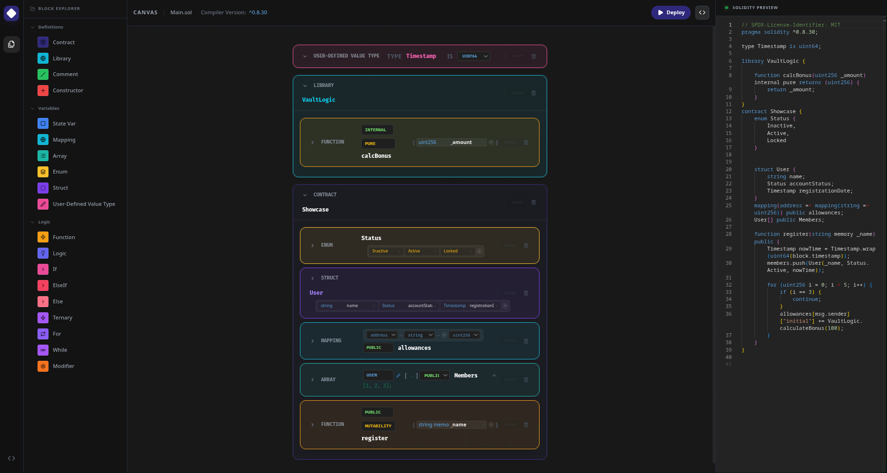

# solidity.build [🚧 Under Construction 🚧]

[](https://react.dev)
[](LICENSE)
[](https://hardhat.org)

[solidity.build](https://copernicium282.github.io/solidity.build/) is a visual, block-based smart contract builder for Ethereum. Drag blocks onto a canvas, configure them inline, and watch Solidity code generate in real time. Compile it in the browser. Deploy it to a local node, or copy the code over to Remix IDE. No prior Solidity experience required. I plan on making it a great learning tool for those who are new to Solidity. 

Inspired by [eth.build](https://eth.build) and [MIT Scratch](https://scratch.mit.edu).

## Screenshots

| Visual Builder | Live Solidity Generation |
| :---: | :---: |
|  |  |

## Table of Contents

- [Background](#background)
- [Getting Started](#getting-started)
- [Block Types](#block-types)
- [Local Deployment](#local-deployment)
- [Tech Stack](#tech-stack)
- [Project Structure](#project-structure)
- [Roadmap](#roadmap)
- [Contributing](#contributing)
- [License](#license)

## Background

Learning Solidity is somewhat hard. Most of the tools such as Remix, Hardhat and Foundry assumes that you already understand the language. Solidity by Example is good and gets the job done, but it is still text-based; I also plan on including those as example modules in the future that can be imported to make the learning experience much better.

solidity.build aims to bridge that gap. Each Solidity concept - state variables, functions, modifiers, events - is represented as a draggable block. You can snap them together, fill in the fields, and the app generates the corresponding Solidity code on the right. The goal is not to replace writing code, but to make the structure of a contract more intuitive before writing one yourself.

## Getting Started

### Prerequisites

- Node.js v18+
- npm or yarn

### Installation

```bash
git clone https://github.com/Copernicium282/solidity.build.git
cd solidity.build
npm install
npm run dev
```

The app runs at `http://localhost:5173` by default.

## Block Types

The following block types are currently implemented:

| Block | Description |
|---|---|
| Contract / Library / Interface | Root blocks, everything else nests inside. Defines the core contract, library, or interface. |
| State Var / Array / Mapping | Storage variables with configurable type, visibility, fixed/dynamic size, constants, and immutability. |
| Enum / Struct / Custom Type | Advanced data structures and user-defined value types. |
| Constructor | Initializer function. Supports dynamic parameter rows and base contract initializers. |
| Function | Configurable visibility, mutability, parameters, modifiers, virtual/override, and return types. |
| Modifier | Named access control or execution wrapper. |
| Control Flow | Blocks for `If`, `ElseIf`, `Else`, `Ternary`, `For`, and `While` logic loops and conditions. |
| Error Handling | Blocks for `Require`, `Assert`, `Revert`, and custom `ErrorDef` declarations. |
| Event / Emit | Event declarations and event emissions inside functions. |
| Receive / Fallback | Special functions for handling incoming raw Ether and unknown function calls. |
| Logic / Comment | Free-form inline logic code snippets and standard comment blocks. |

Generated code is valid Solidity `^0.8.0`.

## Local Deployment

solidity.build compiles contracts in the browser using [solc-js](https://github.com/ethereum/solc-js). All purely Client-Side.

*(Note: Deployment to a local Hardhat node via ethers.js is a planned feature. Once implemented, the workflow below will apply:)*

To set up a local node:

```bash
npm install --save-dev hardhat
npx hardhat init
npx hardhat node
```

This starts a local Ethereum node at `http://127.0.0.1:8545` with funded test accounts. Click **Deploy** in the app and it connects automatically. After deployment, you can call contract functions directly from the UI using the generated ABI.

Testnet deployment (Sepolia) is planned for a future release.

## Tech Stack

- **React + Vite** — frontend framework and build tool
- **@dnd-kit/core** — drag and drop
- **Monaco Editor** — live Solidity code preview
- **solc-js** — in-browser Solidity compilation, no backend required
- **ethers.js v6** — local deployment and contract interaction
- **Tailwind CSS** — styling

## Project Structure

```
src/
  components/    Workspace, Palette, CodePanel, Sidebar
    blocks/      SmartBlock, BlockBody, and property forms
  utils/         solidityGenerator.js, compiler-worker.js
  App.jsx        Main application state and composition
  main.jsx       React entry root
```

The block tree is used for Solidity generation for the `generateSolidity` function, which maps the entire tree to a code string, which is used for Compilation and Deployment.

## Roadmap (also to be extended in the future)

- [X] Visual block editor with drag and drop
- [X] Live Solidity code generation
- [X] In-browser compilation via solc-js
- [ ] Local Hardhat deployment and function calling
- [X] Function body blocks (assignments, conditionals, loops)
- [X] Inheritance support
- [ ] Testnet deployment (Sepolia)
- [ ] Shareable contracts via URL encoding
- [ ] OpenZeppelin block templates
- [ ] Backend persistence (Node.js + PostgreSQL)

Note: the current roadmap kinda doesn't make that much sense, it's just a list of features I want to add. I'm currently using the Solidity By Example code as a roadmap, implementing stuff that can generate the code for each example atleast.

## Contributing

Contributions are welcome. If you find a bug or want to propose a feature, please feel free open an issue, as this is my first major React project and I'm sure there are many things I haven't thought of.

## License

MIT © [Copernicium282](https://github.com/Copernicium282)
